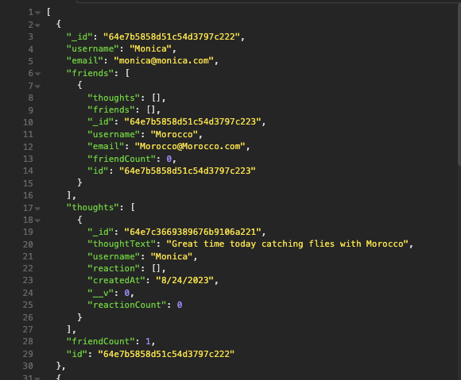

# react-Portfolio
## UCB Bootcamp Module 18 Homework Challenge
### Description
This is my submission for the UCB Bootcamp Module 18 Homework Challenge.  
This submission: 
* Uses a social network theme to demonstrate a noSQL database as Mongoose models synced to a MongoDB database
* Uses node to invoke the application
* Tests API GET, POST, PUT, and DELETE routes in Insomnia

### Future Development
Connect to front-end for visual satisfaction!

### Preview of app

### Review
* Github repository: 
https://github.com/jmariemo/nosql-mongomix

* Walkthrough Video: 
https://drive.google.com/file/d/1zwVsKy49U393eVgEgO6k8QCNI1myPe-V/view
